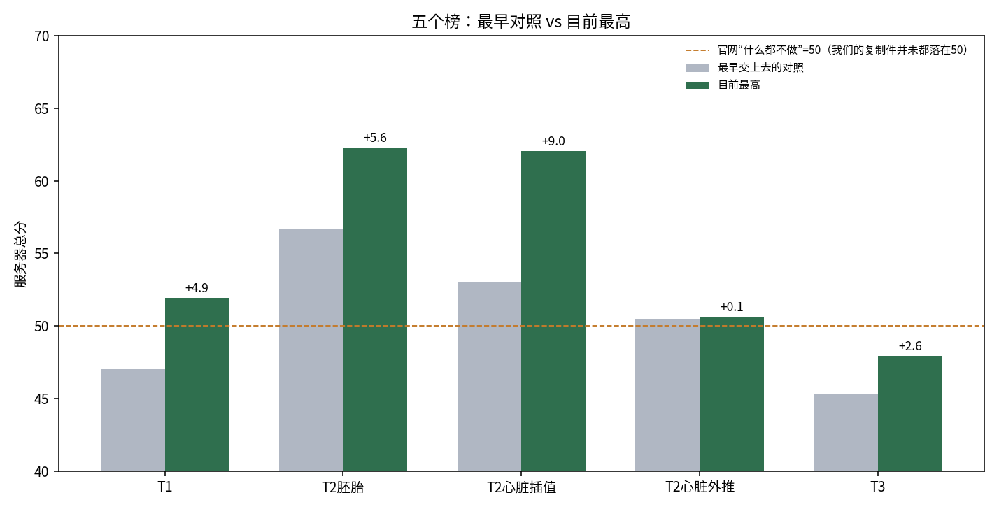
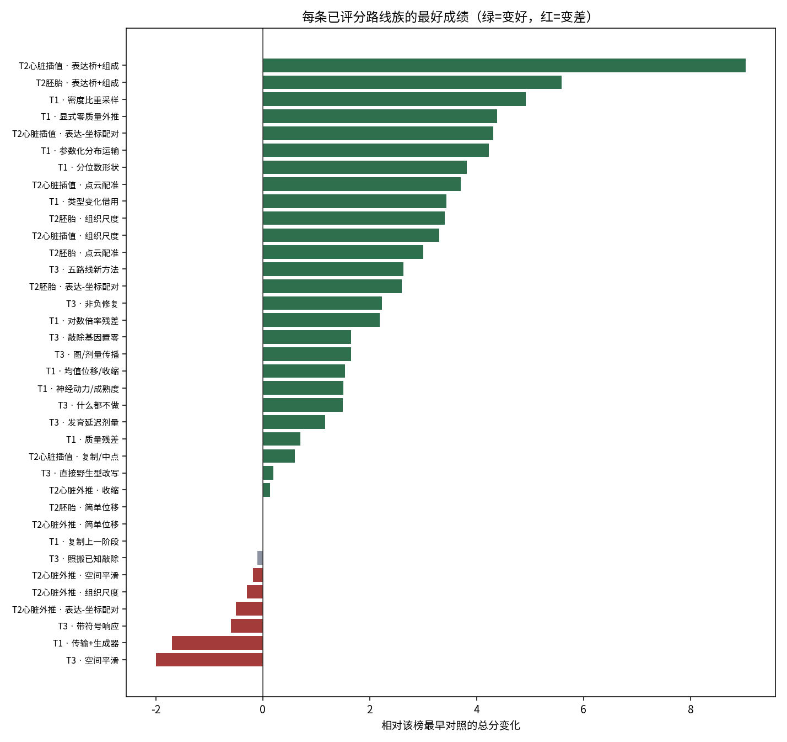
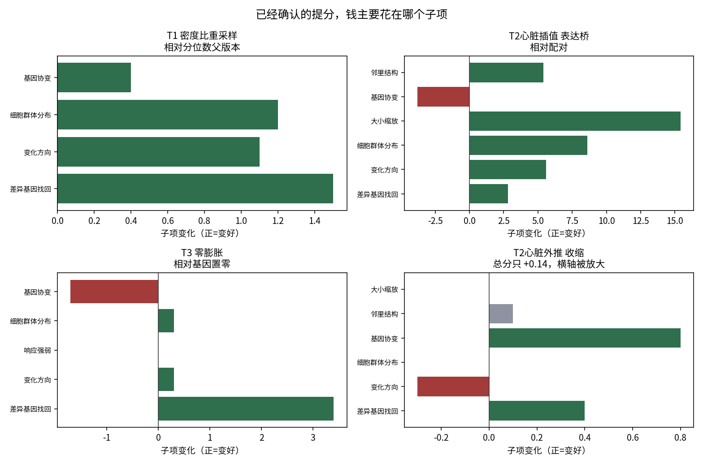

# 已评分路线综述（2026-09-27，2026-09-28 补记 T1 五路线）

这次只谈**已经交到服务器、并且分数已经回填**的路线。本地做过、但没交或还没回分的，单独放在后面，不和服务器结论混写。2026-09-28 把 T1 五路线回分写进本文和图，没有另开新综述。

数字来自 `submissions/INDEX.tsv` 和 `reports/SERVER_SUBMETRIC_REGISTRY.tsv`。老版本 INDEX 里有的总分是页面四舍五入（例如 T1 v0004 记成 48.5，精确值是 48.47）。晋级比较用精确值。没有用子项倒推出总分。

当前官方合计 **158.14** = T1 51.92 + T2 任务分 58.29 + T3 47.93。T2 的 58.29 不是三个榜的分数相加。心脏外推榜已有 50.64，但合计里用的仍是 50.53，差 0.11，还没从门户页面对上，这里不把它算进合计。

## 先看一张图

橙线是官网定义的“什么都不做 = 50”。我们自己交上去的复制件并没有都落在 50 上（T1 复制是 47.0）。所以“超过 50”不能直接理解成“已经超过官方的什么都不做”。这件事以前记过，叫 floor 对不齐，还没解决。

| 榜 | 最早对照 | 目前最高 | 拉开多少 | 最高来自哪条路线 |
|---|---:|---:|---:|---|
| T1 时间 | 47.0 复制上一阶段 | **51.92** | +4.92 | 密度比重采样（v0024，父版本是 50.82 的分位数形状） |
| T2 胚胎插值 | 56.7 简单位移 | **62.29** | +5.59 | 表达桥 + 组成（v0010） |
| T2 心脏插值 | 53.0 复制上一阶段 | **62.04** | +9.04 | 表达桥 + 组成（v0013） |
| T2 心脏外推 | 50.5 简单位移 | **50.64** | +0.14 | 把位移收一点（v0011） |
| T3 敲除 | 45.3 交野生型 | **47.93** | +2.63 | 零膨胀 / hurdle（v0048） |

五个榜里，**心脏插值拉开最多，心脏外推几乎没动**。T1 最高分到了 51.92，刚过官网那条 50 的线一点；T3 的 47.93 仍在线下。复制件和这条线对不齐，所以不能把“过 50”直接说成已经稳定超过“什么都不做”。

## 1. 做完了什么，哪里赚得最多

已评分路线按“在干什么”归成族。下图是各族最好成绩相对**该榜最早对照**的变化。同一张图里，后面的赢家包含了前面已经赚到的分，所以不能把柱子直接理解成“这一步新赚了这么多”。

### 总分：真正拉开差距的只有三步

| 这一步新做了什么 | 和谁比 | 总分 | 这一步自己赚了多少 |
|---|---|---:|---:|
| T2 心脏：表达桥再加细胞组成 | 当时最好的配对 57.31 | 62.04 | **+4.73** |
| T1：在分位数形状父版本上做密度比重采样 | 父版本 v0023 的 50.82 | 51.92 | **+1.10** |
| T1：在严格位移上交分位数形状 | 严格位移 48.47 | 50.82 | **+2.35** |
| T2 胚胎：表达桥再加细胞组成 | 组织尺度 60.1 | 62.29 | **+2.19** |
| T3：零膨胀，不再只把敲除基因置零 | 基因置零 46.95 | 47.93 | **+0.98** |
| T2 心脏外推：把位移收一点 | 简单位移 50.5 | 50.64 | +0.14，可忽略 |

更早的组织尺度、敲除基因置零，各自也赚过约 1.5–3.4 分，但已经被上面这几步盖过，不再是当前最高。

### 子项：钱花在完全不同的地方

四张小图的横轴刻度不一样。外推那张看起来柱子不短，其实最大只有 0.8，总分几乎没动。

**T1 要分成两步看，两步赚的抽屉不一样。**

第一步，分位数形状相对严格位移的 +2.35，大约六成来自基因协变。已知权重是差异基因 25%、方向 25%、群体分布 30%、基因协变 20%。协变从 40.6 到 47.8（+7.2），按权重大约贡献 1.44 分；方向和群体分布各约 0.4 分；差异基因几乎没动（43.8→44.0）。事后核对构建脚本：这一版算过零率一步外推，但最终没有用上，实际是把晚期经验分位映射用到了晚期细胞上。所以 50.82 证明的是这版候选，不是“显式零率外推已经过服务器”。

第二步，密度比重采样相对这个父版本再 +1.10，四个子项都涨，最大的是差异基因 +1.5（44.0→45.5），方向 +1.1，群体分布 +1.2，协变只 +0.4。按权重，这一步的钱主要在差异基因、方向和群体分布，不再是协变。同批里，显式零质量外推 51.38、参数化分布运输 51.23，都好过父版本，但都不如密度比重采样。类型变化借用 50.44、对数倍率残差 49.19，差于父版本。

**T2 心脏插值的大涨，主要是器官大小和细胞群体，不是基因协变。** 大小缩放 +15.4，群体分布 +8.6，邻里结构 +5.4，方向 +5.6。基因协变反而 −3.8。胚胎插值也一样：方向 +14.3，基因协变 −7.0，总分仍然上涨。

**T3 的 +0.98 几乎全是“找对了哪些基因变了”。** 差异基因 39.2→42.6（+3.4）。方向、群体、响应强弱几乎不动。响应强弱在最近八个回分里全是 50.0，这批数据里它不区分好坏。零膨胀把基因协变做差了（51.0→49.3）。旁边的收缩优化（v0046，47.65）协变略好、差异基因少赚 1.4，总分仍低于零膨胀。

一句话：三个任务赚钱的抽屉不一样。T1 先赚协变，再靠密度比重采样补差异基因；T2 赚大小和方向；T3 赚“哪些基因变了”。把一个任务的成功办法原样搬到另一个任务，没有根据。

## 2. 对照最初的原子地图：探索了什么，还没探索什么

最初的施工图在 `docs/batch1/00_START_HERE.md` 和 `docs/batch1/03_NOT_IN_BATCH1.md`。第一批只许做 4 个原子，另外 8 类明确先不做。

| 最初地图 | 后来怎么样 |
|---|---|
| A1 组织尺度（T2） | 做了，也评分了。胚胎 +3.4，心脏插值 +3.3，外推变差。有用，但不是现在的最高。 |
| A2 带符号的敲除响应（T3） | 做了。44.7 / 44.0，比“交野生型”的 45.3 还差。这条实现被服务器否定。 |
| A3 质量残差、保住协方差（T1） | 做了。47.5 / 47.7，好过复制，差过后来的严格位移。没有成为主线。 |
| A4 表达和坐标重新配对（T2） | 做了。心脏插值最多到 57.31，胚胎没有超过尺度路线。小赚，不是主线。 |
| A1+A4 组合 | 没做。当时配对没有明显超过尺度，组合没有启动。 |
| 开放集：预测全新细胞类型 + 外部早期数据 | 没做。卡在 E7.75 未发布，记在 LEADS L-007，触发前不做。 |
| 分支流、不平衡传输 | 部分碰过。全基因流匹配交过，45.3，低于复制。扩散和势景观只在本地失败，没有交。 |
| 完整几何生成、等变流、由粗到细的形状 | 没做成那几类模型。外推上的空间平滑交过，全负。 |
| 端到端的邻里流 | 没做。做过的是配对和配准，不是一个从头生成邻里的模型。 |
| 专门校准“响应有多强” | 没做。最近八次这个子项全是 50.0，可能根本拉不动分。 |
| 条件最优传输、GEARS、PerturbODE | 这些名字没跑过。跑过的是图传播和剂量，12 个版本没有超过“把敲除基因置零”。 |
| 三个任务共用一个大生成器 | 没做。 |
| 多种子、大范围调参 | 按规则没做。 |

地图之外、后来才出现、而且成了当前最高的，是三件最初没列进去的事：

1. T2 的表达桥加细胞组成；
2. T1 的分位数形状，以及叠在它上面的密度比重采样（现在的 T1 最高）；
3. T3 的零膨胀。

所以：**最初原子大多试过了，真正的最高分不在那张图的主原子上，而在后来更窄的分布修改上。** 大模型那一栏，要么没做，要么做了并更差。

## 3. 服务器强否定了什么，又指向哪里

“强否定”只留给交过服务器、而且明显差于当时对照的实现。本地失败只说明那次实验没过，不能写成“这类方法被比赛否定”。

### 服务器已经否定的实现

- **T1 用传输或生成器重画整条表达**：moscot / scDesign 44.8–44.9，全基因流匹配 45.3。都低于复制上一阶段的 47.0。流匹配的协变掉了 10.4。
- **T3 带符号地搬一个已知敲除的响应**：比什么都不做还差。
- **T3 把已知敲除的平均变化照搬过来**：45.2，没有超过野生型。
- **T3 空间平滑**：43.30。协变 51.0→25.0，群体分布 51.5→42.1。这是这批评分里最干净的灾难。
- **T3 图传播和剂量**：12 个版本，最好也只是和“基因置零”打平。图本身没有额外的分。
- **T2 外推上的尺度、配对、空间平滑**：都不高于简单位移。插值上有效的办法，换到外推就失效。
- **T1 继续拧收缩旋钮**：最好 48.54，和严格位移 48.47 落在平局带里。协变只 +1.5，其他子项还略差。这个旋钮没有服务器空间了。
- **T1 对数倍率残差（v0028，49.19）**：比分位数父版本低 1.63。差异基因、方向、群体分布都退，只有协变略涨。不保留零过程、改走倍率残差，服务器不买账。
- **T1 把共同类型的变化借给特有类型（v0026，50.44）**：比父版本低 0.38，四个子项里三个退、协变也退。这次借用没有服务器收益。

### 服务器指向的、还值得做的

- **谁表达、谁不表达，再加上细胞在细状态里的占比。** T3 零膨胀仍是该榜最高。T1 上，分位数形状先把协变拉起来；密度比重采样再在不重排单个基因的前提下改细状态占比，四个子项都涨，成为新高。显式零质量也赚了，但不如密度比。
- **T2 插值要同时改表达和细胞组成，还要让器官大小跟着走。** 只改表达、不改组成的那一臂（心脏插值 56.27）被淘汰；加上组成才到 62.04。
- **基因协变在 T1 的第一步涨得最多，第二步几乎没再涨；在 T2/T3 的赢家里是被牺牲的。** T1 协变现在是 48.2，差异基因 45.5，仍是四个子项里偏低的两个。T2 心脏插值的赢家协变只有 28.4。协变仍有空间，但下一分不一定还在这个抽屉。
- **外推是最大的空档。** 五个榜里只有它几乎没离开出发点。任何把插值赢家直接外推的方案，现有分数都不支持。

## 4. 哪些已确认的方向可以合在一起

合在一起的前提：两个方向赚的不是同一个子项，而且不能用已经被否定的操作去合。

| 可能的组合 | 为什么可能更赚 | 为什么不能直接做 | 最小验证 |
|---|---|---|---|
| T3 零膨胀 + 收缩优化的协变 | 零膨胀赚差异基因、亏协变；收缩（47.65）协变略好。两边赚的抽屉不同。 | 还没证明能把协变补回去而不吃掉 +3.4 的差异基因。 | 一条新候选：零膨胀的零过程不动，只在非零值上套收缩。先本地看协变和差异基因是否同时不退，再决定交不交。 |
| T1 密度比重采样 + 显式零质量里没重复的那部分 | 密度比赚差异基因和群体分布（51.92）；显式零质量协变更高（49.5 vs 48.2），但总分低 0.54。 | 两版都已经交过，不能把低分那版整包叠上去。只许借它多出来的协变，不能动密度比已经赚到的差异基因。 | 先在报告场景做一版“密度比定权、零质量只改协变缺口”。四个子项任一退回父版本以下就停，不交。 |
| T2 表达桥保持，单独补协变 | 桥赚了方向和大小，协变是亏的（胚胎 −7.0，心脏插值 −3.8）。 | 以前用重排或平滑去补协变，服务器和外推都否定了。不能用那种补法。 | 只许做不改每个基因取值集合的协变修正；若本地协变回升但方向掉，就停。 |
| 三个任务共用“零过程”这个想法 | T1 和 T3 的赢家都是零，不是新网络。 | 这不是一个可以共用的模型。数据、基因面板、评分抽屉都不同。 | 不要做统一大模型。各自在自己的榜上扩大零过程的覆盖。 |

不建议的组合：

- 分位数或密度比 + 流匹配 / 扩散 / 对数倍率残差 / 把细胞按基因重新排队。后几类要么服务器更差，要么本地把能量或细胞内聚做崩。类型变化借用这一次也没有加分。
- 表达桥 + 外推空间平滑。平滑在外推上没有正分，在 T3 上是灾难。
- 专门做“响应强弱”。最近八次全是 50.0，先确认这个子项还能不能动，再立项。

## 5. 哪些方向适合放大，哪些放大只会更差

这里的“放大”分两种，不能混。

**适合放大的，是覆盖面和分辨率，不是网络宽度。**

- T1 密度比重采样：这是当前最高，放大指的是权重用多少基因、截断放多宽、细状态分多细，不是把分类器做深。同批已经说明：换成参数化运输、显式零质量、类型借用、对数倍率，都没有更高。不要顺着没赢的那四条加参数。
- T3 零膨胀：差异基因还有空间（42.6，同榜其他子项都在 50 上下）。放大意味着更多基因、分类型的零过程，而不是更大的图。图修复（47.03）已经低于简单的非负均值修复（47.53）。
- T2 表达桥：插值上已经是最高。还能放大的是“组成估计用多少细胞、多少类型”，不是换一个更大的配准网络。配对和配准都试过，没有超过桥。

**不适合放大的，是已经更差的大模型。**

- 传输、扩散、变分自编码器、图传播：服务器或本地门已经看到方差塌、能量爆、或者总分低于对照。把它们做大，没有现有分数支持，和“参数越多越好”的直觉相反。
- 收缩旋钮、外推空间平滑、照搬另一个敲除：继续加剂量或加平滑强度，现有结果是平局或更差。
- 把插值的桥放大到外推：外推榜上，尺度和配对都低于简单位移。插值的成功不能按时间步乘出去。

## 这次没算进去的

- T3 还有 v0037、v0040、v0041 没回分。上传额度当天用完，不在这 8 个分数里。它们回来之前，不把“五路线 / 修复”说成全部评完。
- T2 九条新路线只写了设计，还没跑、没交。
- T1 五路线已全部回填，写进上面的表。残差解码的旧加法版本仍只在本地关闭；交上去的是对数倍率那一版，服务器 49.19，已否定。
- 本地分数和服务器分数多次方向相反。上面的“潜力”是筛选建议，不是预测下一次能加多少分。

## 图和表

- `figures/01_board_best_vs_baseline.png`
- `figures/02_family_gain.png`
- `figures/03_submetric_deltas.png`
- `tables/all_scored.tsv`：全部已有总分的版本
- `tables/family_best.tsv`：路线族最好成绩
- `tables/submetric_delta.tsv`：子项变化
- `build_review_assets.py`：图和表的生成脚本，只读台账
